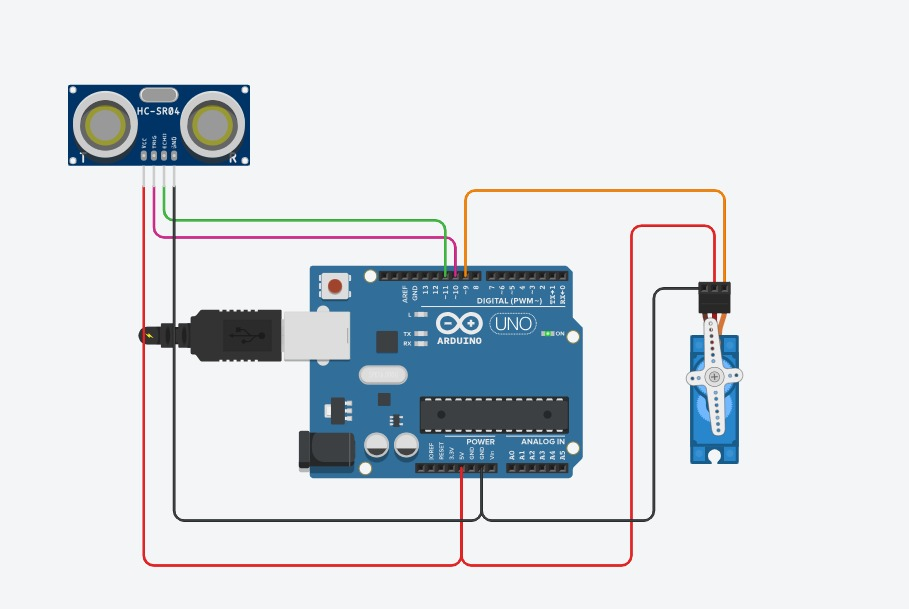
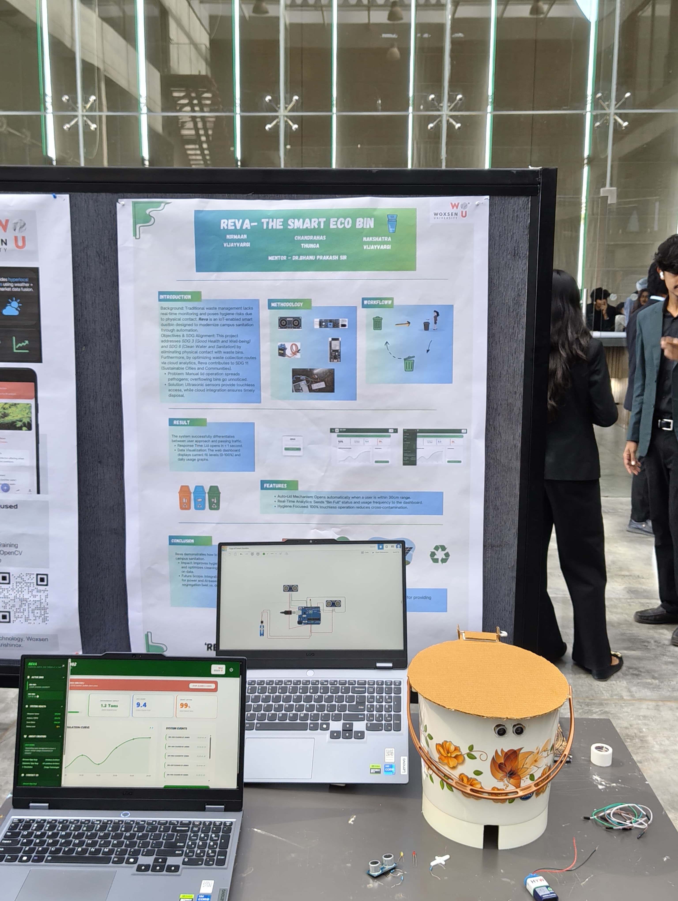

<div align="center">

# ♻️ REVA

### Reviving the Earth, One Throw at a Time


<br>

An **IoT-powered Smart Waste Management System** that automates waste disposal using an **Arduino Uno**, **HC-SR04 Ultrasonic Sensors**, a **Servo Motor**, and a **real-time monitoring dashboard**.

---


</div>
---

# 🎥 Demo

<p align="center">
  
</p>

<p align="center">
  <i>REVA automatically detects a user's hand, opens the lid using a servo motor, and updates the dashboard with real-time waste monitoring.</i>
</p>
---

# 📖 Overview

REVA is an IoT-based Smart Waste Management System designed to improve hygiene and automate waste disposal.

The system uses an **HC-SR04 Ultrasonic Sensor** to detect when a user approaches the bin. An **Arduino Uno** processes the sensor data and commands a **Servo Motor** to automatically open and close the lid without physical contact.

The prototype also supports a **web dashboard** that displays real-time bin information, allowing administrators to monitor waste levels remotely.

### Objectives

- Touchless waste disposal
- Better hygiene
- Smart monitoring
- Reduced overflow
- Sustainable waste management
---

# ✨ Features

- 🗑️ Automatic touchless lid opening
- 📏 HC-SR04 ultrasonic distance sensing
- ⚙️ Servo motor-based lid control
- 📊 Real-time monitoring dashboard
- 🌐 IoT-enabled architecture
- ♻️ Hygienic waste disposal
- 📈 Smart waste analytics
- 🟢 Easy to build and low cost
---

---

# 🏗️ System Architecture

<p align="center">

</p>

The REVA architecture follows a simple IoT workflow:

**User → HC-SR04 Sensor → Arduino Uno → Servo Motor + Web Dashboard**

The ultrasonic sensor detects a user's hand, the Arduino processes the input, activates the servo motor, and updates the monitoring dashboard.
---

# 🔌 Circuit Diagram

<p align="center">

</p>

Hardware Components:

- Arduino Uno
- HC-SR04 Ultrasonic Sensor
- Servo Motor
- LEDs
- Power Supply


---

# 📊 Dashboard

<p align="center">

</p>

The dashboard allows administrators to monitor waste levels, environmental impact, system status, and cleaning activity in real time.


---

# 📸 Project Gallery

<p align="center">


<br><br>




</p>

---

# 🎥 Demo

<p align="center">


</p>

If GitHub does not render the GIF correctly, the demo video is available in:

`assets/demo/demo.mp4.mp4`

---

# 📁 Project Structure

```
REVA
│
├── arduino/
├── assets/
│   ├── branding/
│   ├── demo/
│   ├── diagrams/
│   └── screenshots/
│
├── docs/
├── hardware/
├── web-dashboard/
│
├── README.md
└── LICENSE
```

---

# 🔧 Hardware Components

| Component | Purpose |
|------------|---------|
| Arduino Uno | Main Controller |
| HC-SR04 Ultrasonic Sensor | Detects User & Waste Level |
| Servo Motor | Automatic Lid Opening |
| LEDs | Status Indicators |
| Breadboard | Circuit Connections |
| Jumper Wires | Wiring |
| USB Power Supply | Power |

---

# ⚙️ Software Stack

- Arduino IDE
- HTML
- CSS
- JavaScript
- IoT
- Git & GitHub


---

# 🚀 How It Works

1. A user approaches the smart bin.
2. The HC-SR04 ultrasonic sensor detects the user's hand.
3. The Arduino Uno processes the sensor input.
4. The servo motor automatically opens the lid.
5. After a short delay, the lid closes automatically.
6. Sensor data is displayed on the web dashboard for monitoring and analytics.

---

# 💻 Installation

## Clone the repository

```bash
git clone https://github.com/Nakshatravijayvargi/REVA.git
```

## Open Arduino Code

Open:

```
arduino/reva.ino
```

Upload it to your Arduino Uno using the Arduino IDE.

## Open the Dashboard

Navigate to:

```
web-dashboard/
```

Open:

```
index.html
```

or host it using Live Server in VS Code.

---

# 🔮 Future Improvements

- ESP32 Wi-Fi Integration
- Cloud Database Support
- Mobile Application
- AI-based Waste Prediction
- Smart Route Optimization
- Solar Powered Operation
- Multiple Bin Monitoring
- Notification System

---

# 👨‍💻 Team

- **Nakshatra Vijay Vargi**
- **Nirmaan Vijay Vargi**
- **Chandrahas Thunga**

---

# 🎓 Mentor

**Dr. Bhanu Prakash**

---

# 📄 License

This project is licensed under the **MIT License**.

See the LICENSE file for details.

---

<div align="center">

## ⭐ If you found this project interesting, consider giving it a star!

Made with ❤️ to build cleaner and smarter communities.

</div>
